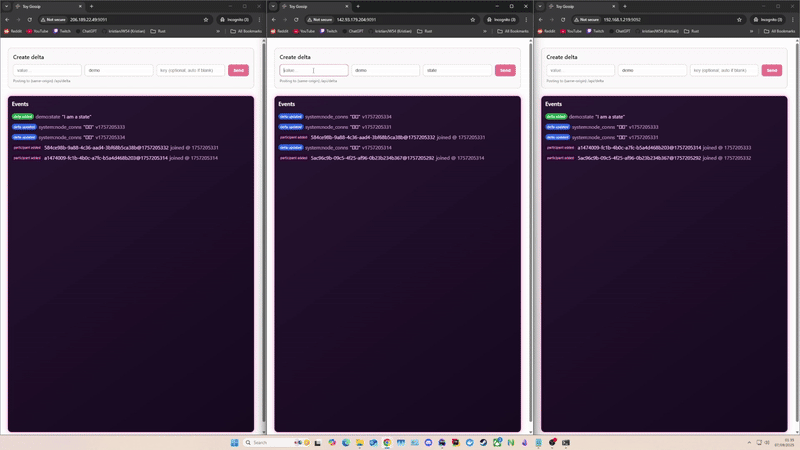

# GoferBroke Toy App

This is a **visual showcase app** for the [GoferBroke](https://github.com/kristianJW54/GoferBroke) **gossip engine**. Each instance of the app launches a full GoferBroke node, gossips deltas, and emits real-time application events.

> Great for testing, visualizing, or extending GoferBroke into your own systems.

---



## Purpose

This app exists to:

- ✅ **Demonstrate** how GoferBroke can power distributed state sync
- ✅ **Visualize** real-time gossip events (deltas, joins, failures)
- ✅ **Show** how applications can subscribe to gossip **events** to drive logic
- ✅ **Test locally** with multiple node instances

Each running instance is a full **cluster node** with its own:
- Gossip engine
- Delta store
- Web UI
- CLI-configurable identity

---

## How It Works

### Core Engine: GoferBroke

The app embeds the [GoferBroke gossip engine](https://github.com/kristianJW54/GoferBroke), which:
- Spreads state updates via **anti-entropy gossip**
- Tracks participant health via **phi accrual failure detection**
- Sends structured **event notifications** for app-level use

### App Logic

Each instance:
- Starts a GoferBroke node via CLI flags
- Hosts a local web UI (`/`)
- Exposes `/events` (SSE) and `/api/delta` (POST) endpoints
- Converts engine events into frontend-readable JSON:
    - `delta_added`
    - `delta_updated`
    - `participant_added`
    - `participant_dead`

---

## Getting Started

### Prerequisites

- Go 1.21+
- Node.js 20+
- Git

---

## Setup & Run (Windows & Linux)

This guide walks you through cloning, building, and running your GoferBroke toy app with embedded UI on both **Windows** and **Linux**.

### 1. Clone the Project

```bash
git clone https://github.com/kristianJW54/GoferBroke-toy-app.git
cd GoferBroke-toy-app
```

### 2. Build or Run Binary

To build, run

```bash
npm install
npm run build
```

**For Windows**

To build you own binary to run

```powershell
go build -o toyapp.exe .
```

A pre-built binary exists **toyapp.exe**

Run:

```powershell
./toyapp.exe --mode=seed --name="t-1" --nodeAddr="localhost:8081" --clientPort="5002" --web="localhost:9092" --routes="localhost:8081" --network=LOCAL
```

And in another terminal

```powershell
./toyapp.exe --mode=node --name="t-2" --nodeAddr="localhost:8082" --clientPort="5003" --web="localhost:9093" --routes="localhost:8081" --network=LOCAL
```

**For Linux**

To build you own binary to run

```powershell
go build -o toyapp-linux .
chmod +x toyapp-linux
```

A pre-built binary exists **toyapp-linux**

Run:

```powershell
./toyapp-linux --mode=seed --name="t-1" --nodeAddr="localhost:8081" --clientPort="5002" --web="localhost:9092" --routes="localhost:8081" --network=LOCAL
```

And in another terminal

```powershell
./toyapp-linux --mode=node --name="t-2" --nodeAddr="localhost:8082" --clientPort="5003" --web="localhost:9093" --routes="localhost:8081" --network=LOCAL
```


## CLI Flags

| Flag          | Description                            |
|---------------|----------------------------------------|
 | `--mode`      | `seed` or `node`                       |
| `--name`      | Node name (unique per instance)        |
| `--nodeAddr`  | Gossip engine listener (`host:port`)   |
| `--clientPort` | Reserved for future internal API use   |
| `--web`       | Port the web UI will be served on      |
| `--network`   | LOCAL, PUBLIC or PRIVATE               |
| `--routes`    | Seed node(s) to connect to (repeatable) |

---

## Event-Driven App Logic

Gossip events power the app.

When deltas change or nodes join/leave, the engine triggers:
```go
node.OnEvent(gossip.DeltaUpdated, func(e Event) {
    // Your app logic here
})
```

In this app:
- Events are wrapped and pushed to an in-memory channel
- The `/events` endpoint streams them to the UI via **SSE**
- The frontend shows the gossip state live

You can **subscribe to these events in your own app** to trigger:
- Cache invalidation
- Reactions to node failures
- Coordinated workflows
- Real-time messaging

---

##  Project Structure

```txt
/
├── cmd/main.go         # Starts the Go server and node
├── public/             # Static assets (logo, etc.)
├── src/                # Svelte source
├── dist/               # Built frontend
└── README.md
```

---

## Powered By

- ⚙️ [GoferBroke](https://github.com/kristianJW54/GoferBroke)
- 🎨 Svelte
- 🌐 Go + Fiber (backend)
- 💬 Server-Sent Events

---

##  License

use freely and fork away!

---

## 🫶 Contribute

Pull requests welcome — clone it, break it, improve it.